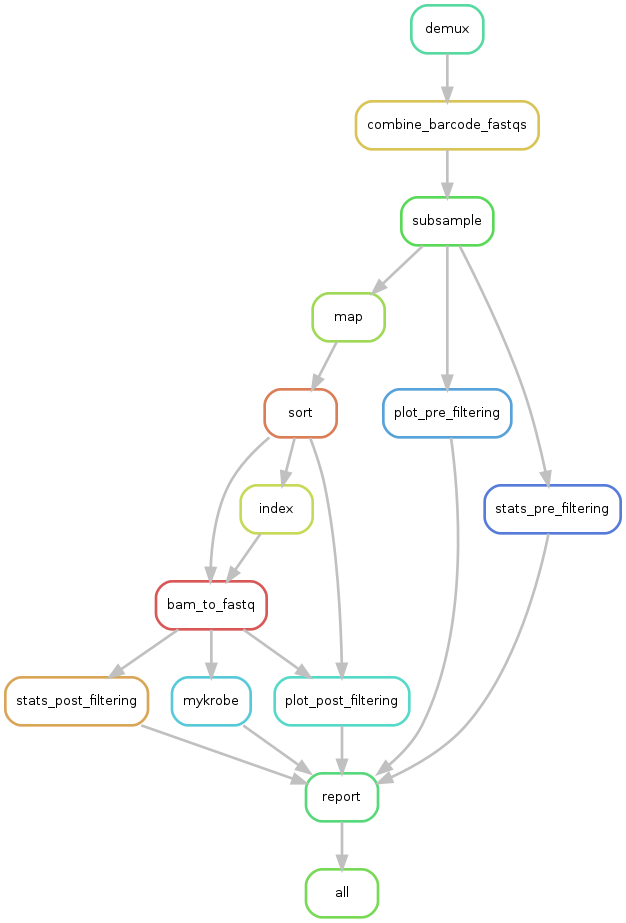

========================================
Analysis pipeline for *M. tuberculosis* nanopore data
========================================

.. contents:: **Table of Contents**

Overview
========================================

This pipeline is designed to analyse Oxford Nanopore Technologies sequence data.
It was developed (and will continue to be improved) as part of a project to
improve tuberculosis diagnostics using nanopore sequencing. The project is being
run by a global group of researchers and clinicians from Madagascar’s National
TB Program, Institute Pasteur Madagascar (IPM), University of Oxford, European
Bioinformatics Institute (EMBL-EBI) and Stony Brook University. More
information and a short video of the project can be found `here`_.

The analysis run by the pipeline is:

1. Adapter trimming of the basecalled reads (and demultiplexing if required).
2. Alignment to a given reference genome (default is `NC_000962.3`_).
3. Plots and statistics of the data after the above.
4. A final HTML report summarising all results. `EXAMPLE REPORT`_

Installation
========================================
**Note: the following instructions assume you are working on a Linux operating system and have Python version 3.5 or greater.**

The first thing to do is download this repository onto the machine you want to
run the analysis on. In the spirit of making everything reproducible and tidy I
would advise to download this repository once for each nanopore experiment you
want to analyse.

Let's create our experiment directory and clone the pipeline.

.. code-block:: bash

    experiment=sample1
    git clone https://github.com/iqbal-lab-org/Mykrobe_tb_workflow.git "$experiment"
    cd "$experiment"
    project_dir=$(pwd)
    mkdir -p ${project_dir}/logs

This will download the pipeline repository into a directory named ``sample1``.

Install Singularity
---------------------
Singularity containers can be used to package entire scientific workflows,
software and libraries, and even data. This means that you don’t have to ask
your cluster admin to install anything for you - you can put it in a Singularity
container and run. A Singularity container with all the programs required to run
this analysis is provided with the pipeline, but in order to use Singularity
containers you need to have Singularity installed. If you don't have Singularity
installed, you can find `detailed instructions here`_.

Install Snakemake
---------------------
Snakemake_ is a workflow management system which coordinates the running of this
pipeline. In order to install it you will need to make sure you have Python3_
installed. It is best to manage all of this in a python virtual enviornment. In
this repository there is a ``Pipfile`` which can be used to set up an
environment with `pipenv`_ very easily.

To install ``pipenv``, just run:

.. code-block:: bash

    pip3 install --user pipenv

Then all you need to do is run:

.. code-block:: bash

    cd "$project_dir"
    pipenv install
    pipenv shell

This will install the required python packages ``snakemake`` and ``docutils``
and activate the virtual environment.

If you do not want to use a python virtual environment then run:

.. code-block:: bash

    cd "$experiment"
    pip3 install snakemake docutils

Analysis setup
========================================
Singularity containers
--------------------------------

There are two ways of obtaining the Singularity container required for this
pipeline:

Download from Singularity Hub (recommended)
^^^^^^^^^^^^^^^^^^^^^^^^^^^^^^^^^^^^^^^^^^^^^

.. image:: https://www.singularity-hub.org/static/img/hosted-singularity--hub-%23e32929.svg
  :target: https://singularity-hub.org/collections/1145

.. code-block:: bash

    cd "$project_dir"
    container_name=containers/tb.simg
    singularity pull --force --name "$container_name" shub://iqbal-lab-org/Mykrobe_tb_workflow:tb

Build container locally
^^^^^^^^^^^^^^^^^^^^^^^^^^

If for whatever reason you choose not to download the container, you can build
it yourself using the included Singularity recipe file.

.. code-block:: bash

    cd "$project_dir"
    container_name=containers/tb.simg
    sudo singularity build "$container_name" containers/recipes/Singularity.tb

If you are going to be running this pipline for many different samples on the
same machine, it is recommended to only download/build the container once, as it is
about 1GB. Change ``container_name`` in the above code to a more central
directory and make sure to update the container location in ``config.yaml`` (see
below).

Initial data location
--------------------------------------------
The pipeline expects that the data you want to analyse is placed in specific
directories. Whilst this may seem a bit rigid, it is all in the name of
reproducibility.

.. _non_barcoded_sample:

Non-barcoded sample
^^^^^^^^^^^^^^^^^^^^^^

For a single sample with no barcoding (and therefore no demultiplexing required)
you just need to ensure there is a single fastq file of the basecalled reads.
Generally, when a sample has been basecalled there is multiple fastq files (the
default for Albacore for instance has 4000 reads per fastq). Additionally, these
fastq files are normally split across two folders: "pass" and "fail". The
assignment of reads into these folders is based on a Phred quality score threshold
(at the time of writing this it is 7). It is recommended that you work with the
reads in the "pass" folder. To combine the fastq files into a single file

.. code-block:: bash

    # change into the pass directory where all the fastq files are
    cd /path/to/basecalled/fastq_files
    cat *.fastq | gzip > ${experiment}.fastq.gz

Once you have this single, combined fastq file, we need to move it into the
appropriate pipeline data folder. **Note:** The combined file must have the
same name as the variable ``experiment`` we set earlier. It must also be
'gzip'ed.

.. code-block:: bash

    # make the directory we will move the combined file into
    mkdir -p ${project_dir}/data/basecalled
    mv /path/to/combined/fastq/${experiment}.fastq.gz ${project_dir}/data/basecalled/
    cd ${project_dir}

Barcoded sample
^^^^^^^^^^^^^^^^^^^^

If you are working with multiplexed (barcoded) samples, then the directory that
the basecalling was done into should contain subdirectories named after the
barcode they were binned into by the basecaller. You will need to moved these
directories (in exampe below) to a directory in the experiment pipeline. If you
did not select the barcoding option for basecalling, but the samples are
barcoded, then do the following for the fastq files produced by the basecalling.
**Note:** we generally only work with files in the "pass" directory (see
explanation in `Non-barcoded sample`_ instructions).

.. code-block:: bash

    # make the directory we will move the reads into
    mkdir -p ${project_dir}/data/basecalled/
    # change into dir containing barcode folders - normally workspace/pass/
    cd /path/to/dir/containing/barcode/folders/
    # use `cp -r` instead of `mv` if you want to copy the folders instead
    find . -maxdepth 1 -type d -exec mv '{}' ${project_dir}/data/basecalled/ \;
    cd ${project_dir}

Configuration file
--------------------
This is the file ``config.yaml`` located in the pipeline root directory.

Open this file up in a text editor and change the following fields, if necessary:

* **multiplexed** - Default is ``false``. Change to ``true`` if sample is multiplexed. If set to ``true`` then you **MUST** enter information for ``barcodes`` as well (see below).
* **sample_name** - If ``multiplexed`` is set to ``false`` then this is the name of your sample. **Note: this MUST be the value of** ``experiment`` **we defined at the start of the installation instructions**. If ``multiplexed`` is set to ``true`` then ignore this field.
* **barcodes** - If ``multiplexed`` is set to ``true`` then this needs to be a **space-separated** string of the expected barcodes (the ones you used in the experiment). An example of barcodes 01-05 is provided. These **MUST** follow the same format of ``BC`` followed by 2 digits (e.g ``"BC01 BC02 BC03"``). If ``multiplexed`` is set to ``false`` then ignore this field.
* **reference** - The genome you would like to align the reads to. This is set by to default to the reference provided with the pipeline - `NC_000962.3`_.
* **flowcell** - The flowcell used (if known). Default is ``FLO-MIN106``
* **kit** - The sequencing kit used (if known). Default is ``SQK-LSK108``
* **container** - If you have downloaded/built the Singularity container in a different location to the default (``containers/tb.simg``) then change the path for the container to the location you have it stored at.

Cluster configuration file
----------------------------
This is the file ``cluster.yaml`` located in the pipeline root directory. It
holds the settings for running the pipeline on a cluster, but also for the
resource allocation for jobs. So even if you're running the pipeline on a local
computer the resources from this file will be used.

The fields are pretty self-explanatory so feel free to change them you see fit.
The one section in this you **should** change is under ``__defaul__``:``name`` -
name ``JOBNAME`` something useful, such as the current value of ``$experiment``.

The cluster configuration provided is also used by snakemake if it is to be run
on a cluster and is how it knows what resources to ask for for each job. This
file has been tested successfully on the LSF cluster management system. For more
information on using snakemake on other cluster management systems, `see the documentation`_.
**Note:** if you change the memory parameter for a rule, ensure you also change
the value in resources in the two places with that value.

Run
======
You are all set up now. To run the pipeline simply execute the following. At the
end, all of the logs will be under ``logs/``. Data will be in the appropriate
subdirectories in ``data/`` and the final report(s) (one for each barcode) will
be under ``docs/``.

Local
--------

To run the pipeline on a local computer (i.e laptop or desktop)

.. code-block:: bash

    cd ${project_dir}
    snakemake --use-singularity --cluster-config cluster.yaml

This will provide a summary of all the jobs that are to be run, and when they
have been started and finished.

Cluster
---------
This pipeline can also be run on a cluster. These instructions are for running
on an LSF cluster system. The ``cluster.yaml`` file *should* be general across
clusters (except for the ``resources`` field). The cluster submission command
however is different from cluster to cluster. We provide the command for an
LSF system here. Please contact us if you use a different cluster system and
cannot figure out the command and we will see if we can help. Additionally, if
you use a different cluster management system and successfully run it, please
provide the cluster submission commands and we will add them into these
instructions for others to use.

There is script provided in the scripts directory for submitting the job to an
LSF cluster. To run this you just need to be in the pipeline root directory
and provide a name for the job (to be used by the cluster).

.. code-block:: bash

    cd ${project_dir}
    JOB_NAME=snakemake_master_process
    bash scripts/submit_lsf.sh "$JOB_NAME"

All the log files for the cluster jobs will be prefixed with ``cluster_``.

.. _Singularity: http://singularity.lbl.gov/
.. _`detailed instructions here`: http://singularity.lbl.gov/install-linux
.. _Snakemake: https://snakemake.readthedocs.io/en/stable/index.html
.. _Python3: https://www.python.org/downloads/source/
.. _NC_000962.3: https://www.ncbi.nlm.nih.gov/nuccore/NC_000962.3
.. _pipenv: https://docs.pipenv.org/
.. _`EXAMPLE REPORT`: https://rawgit.com/iqbal-lab-org/Mykrobe_tb_workflow/master/docs/example_report.html
.. _`see the documentation`: https://snakemake.readthedocs.io/en/latest/snakefiles/configuration.html#cluster-configuration
.. _here: https://nanoporetech.com/about-us/news/public-health-teams-madagascar-pioneer-use-portable-real-time-dna-sequencing-fight
